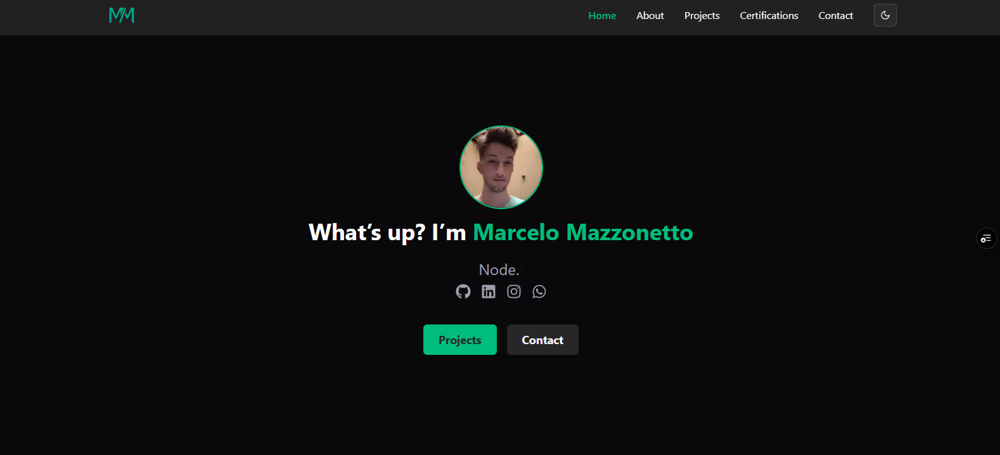

# 🌟 Portfolio Pessoal - Marcelo Mazzonetto



<div align="center">

[](https://your-portfolio-url.vercel.app)
[](https://github.com/DDANCING/PortifolioDev)
[](https://nextjs.org/)
[](https://typescriptlang.org/)

</div>

## 📋 Sobre o Projeto

Este é meu portfólio pessoal desenvolvido com as mais modernas tecnologias do ecossistema React/Next.js. O projeto apresenta meus trabalhos, certificações e habilidades como desenvolvedor full-stack, com foco em experiência do usuário e design responsivo.

### ✨ Características Principais

- 🎨 **Design Moderno**: Interface clean e profissional
- 🌙 **Modo Escuro/Claro**: Tema dinâmico com next-themes
- 📱 **Responsivo**: Funciona perfeitamente em todos os dispositivos
- ⚡ **Performance**: Otimizado com Next.js 15 e Turbopack
- 🎬 **Animações Suaves**: Utilizando Framer Motion
- 📧 **Formulário de Contato**: Integração com Nodemailer
- 🎯 **SEO Otimizado**: Meta tags e estrutura semântica

## 🚀 Tecnologias Utilizadas

### Frontend
- **⚛️ React 19** - Biblioteca JavaScript para interfaces
- **🔄 Next.js 15.3.2** - Framework React com SSR/SSG
- **📘 TypeScript** - Tipagem estática para JavaScript
- **🎨 Tailwind CSS** - Framework CSS utilitário
- **🎬 Framer Motion** - Biblioteca de animações
- **🎭 Next Themes** - Gerenciamento de temas
- **✨ Shadcn/ui** - Componentes UI reutilizáveis

### Bibliotecas e Ferramentas
- **📧 Nodemailer** - Envio de emails
- **🎮 Lucide React** - Ícones modernos
- **⚡ React Icons** - Coleção de ícones
- **✍️ Typewriter Effect** - Efeito de máquina de escrever
- **🔔 Sonner** - Sistema de notificações
- **🎯 Heroicons** - Ícones SVG otimizados

### Desenvolvimento
- **🔧 ESLint** - Linting de código
- **⚙️ PostCSS** - Processamento de CSS
- **🏗️ Turbopack** - Bundler ultra-rápido

## 📁 Estrutura do Projeto

```
portfolio/
├── 📁 public/                  # Arquivos estáticos
│   ├── 🖼️ image.png          # Preview do portfolio
│   ├── 🏠 Logo.png           # Logo do projeto
│   ├── 👤 profile.jpg        # Foto de perfil
│   └── 📁 projects/          # Imagens dos projetos
├── 📁 src/
│   ├── 📁 app/               # App Router (Next.js 13+)
│   │   ├── 🏠 page.tsx       # Página inicial
│   │   ├── 📄 about/         # Página sobre
│   │   ├── 🎓 Certifications/ # Página de certificações
│   │   ├── 📞 contact/       # Página de contato
│   │   ├── 🚀 projects/      # Página de projetos
│   │   ├── 🔧 api/           # API Routes
│   │   └── 🧩 components/    # Componentes das páginas
│   ├── 📁 components/        # Componentes reutilizáveis
│   │   ├── 🎨 theme-provider.tsx
│   │   └── 📁 ui/           # Componentes UI (Shadcn)
│   ├── 📁 contents/         # Dados do conteúdo
│   │   ├── 🎓 certifications.ts
│   │   └── 🚀 projects.ts
│   ├── 📁 lib/              # Utilitários
│   ├── 📁 types/            # Definições TypeScript
│   └── 📁 utils/            # Funções auxiliares
└── ⚙️ Arquivos de configuração
```

## 🎯 Principais Seções

### 🏠 Hero Section
- Apresentação pessoal com efeito typewriter
- Links para redes sociais
- Botão de download do currículo

### 🚀 Projetos
Showcase dos principais projetos desenvolvidos:

1. **ProjectA** 🎵
   - Escola de música inovadora
   - Tecnologias: Next.js, TypeScript, AI, Python, Stripe, Prisma
   - [Demo](https://projecta-marcelo-mazzonettos-projects.vercel.app/) | [GitHub](https://github.com/DDANCING/ProjectA)

2. **Toctok** 🏠
   - Plataforma imobiliária no formato TikTok
   - Tecnologias: Next.js, TypeScript, Prisma, Auth.js v5
   - [Demo](https://toctok.vercel.app/) | [GitHub](https://github.com/DDANCING/toctok)

### 🎓 Certificações
- Graduação em Engenharia de Software
- Cursos especializados
- Certificações técnicas

### 📞 Contato
- Formulário funcional integrado com API
- Validação de dados
- Envio por email via Nodemailer

## 🛠️ Como Executar o Projeto

### Pré-requisitos
- Node.js 18+ instalado
- npm, yarn ou pnpm

### Instalação

1. **Clone o repositório**
```bash
git clone https://github.com/DDANCING/PortifolioDev.git
cd portfolio
```

2. **Instale as dependências**
```bash
npm install
# ou
yarn install
# ou
pnpm install
```

3. **Configure as variáveis de ambiente**
```bash
# Crie um arquivo .env.local na raiz do projeto
# e adicione suas configurações de email
EMAIL_USER=seu-email@gmail.com
EMAIL_PASS=sua-senha-de-app
```

4. **Execute o projeto em desenvolvimento**
```bash
npm run dev
# ou
yarn dev
# ou
pnpm dev
```

5. **Abra no navegador**
```
http://localhost:3000
```

## 📦 Scripts Disponíveis

```bash
npm run dev      # Executa em desenvolvimento com Turbopack
npm run build    # Gera build de produção
npm run start    # Executa build de produção
npm run lint     # Executa verificação de código
```

## 🎨 Personalização

### Temas
O projeto utiliza `next-themes` para alternar entre modo claro e escuro. As cores são definidas no arquivo `globals.css` usando CSS Variables.

### Componentes
Todos os componentes UI são baseados no Shadcn/ui e podem ser facilmente customizados através do arquivo `components.json`.

### Conteúdo
- **Projetos**: Edite `src/contents/projects.ts`
- **Certificações**: Edite `src/contents/certifications.ts`
- **Tipos**: Defina em `src/types/index.ts`

## 🚀 Deploy

O projeto está configurado para deploy automático na Vercel:

1. Conecte seu repositório na Vercel
2. Configure as variáveis de ambiente
3. Deploy automático a cada push

[](https://vercel.com/new/git/external?repository-url=https://github.com/DDANCING/PortifolioDev)

## 📈 Performance

- ⚡ **Core Web Vitals** otimizados
- 🖼️ **Imagens otimizadas** com Next.js Image
- 📦 **Bundle size** minimizado
- 🔄 **SSG/SSR** para melhor SEO

## 🤝 Contribuição

Contribuições são sempre bem-vindas! Para contribuir:

1. Fork o projeto
2. Crie uma branch para sua feature (`git checkout -b feature/AmazingFeature`)
3. Commit suas mudanças (`git commit -m 'Add some AmazingFeature'`)
4. Push para a branch (`git push origin feature/AmazingFeature`)
5. Abra um Pull Request

## 📄 Licença

Este projeto está sob a licença MIT. Veja o arquivo [LICENSE](LICENSE) para mais detalhes.

## 📞 Contato

**Marcelo Mazzonetto** 
- 🌐 Portfolio: [Seu Portfolio](https://your-portfolio-url.vercel.app)
- 💼 LinkedIn: [Seu LinkedIn](https://linkedin.com/in/seu-perfil)
- 📧 Email: seu-email@gmail.com
- 🐱 GitHub: [@DDANCING](https://github.com/DDANCING)

---

<div align="center">

**⭐ Se gostou do projeto, deixe uma estrela!**

Feito com ❤️ por [Marcelo Mazzonetto](https://github.com/DDANCING)

</div>
